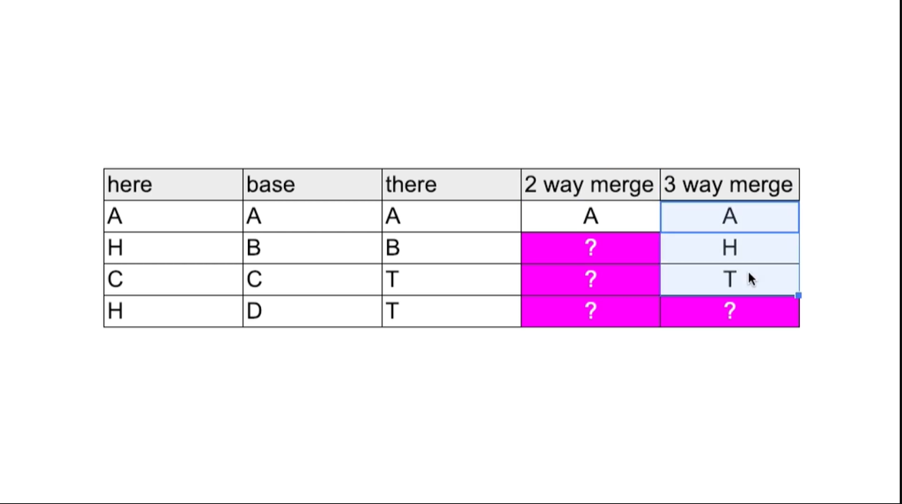

## 2. branch & conflict

branch 는 가지라는 뜻임

줄기에서 뻗어서 나오는 가지

만약 내가 만들던 프로그램이 좋아가지고 여기 저기 다른 회사들이 막 계약을 하자고 그래

근데 각 회사마다 요구사항 같은게 달라서 조금씩 다르게 구현해서 서비스 해야한다면?

그리고 그걸 어떤걸 합치고 막 이래야 한다면?

---

자 브런치를 해보기 전에

- git log --all --graph --online

요걸 쳐주면 로그 보는데에 좀 더 편하게 해준데

- git branch

라고 츠면 `master`만 나오는데 현재까지 기본 버전으로 했다는걸 보여줌

만약에 내가 `apple` 이라는 버전을 만들고 싶다

```git
git branch apple
```

하면 apple 버전이 생성이 되는데

여기서 다시 git branch 를 치면

```git
$ git branch
  apple
* master
```

이렇게 애플이 추가된게 보이지 그리고 현재 위치는 마스터 (별 위치)

좀 더 버전을 늘려보면

```git
$ git branch
  apple
  google
* master
  ms
```

이렇게 됨 ㅋ

자 여기서 내가 만약에 작업을 했어

그리고 add commit 했어 이걸 log 로 확인해보면

```git
commit 40d8fc269d8c628f49764d4da52aafd27abbfbd7 (HEAD -> master)
Author: lugia574 <66871221+lugia574@users.noreply.github.com>
Date:   Tue Jun 20 19:07:17 2023 +0900

    master work

commit 15473a8c06d0ee4e56b27361a2525bfe853a9265 (ms, google, apple)
Author: lugia574 <66871221+lugia574@users.noreply.github.com>
Date:   Mon Jun 19 20:14:08 2023 +0900

    "revert r3 haha"
    Revert "R4"

    This reverts commit b8a7db79740d6b5d4d74bcc495d5c930591a893c.
```

이렇게 버전이 달라진걸 볼 수 있음

이러면 이제 `git checkout apple` 로 apple 버전으로 가보자

그리고 거기서 새로 작성도 해보고 파일도 하나 더 만들어보고 그리고 나서 add, commit 을 해봐

(새로운 파일이 생겼을테니 add 하고 commit 해야함)

```git
git add .

git commit -m "apple work"
```

이걸 google, ms 도 해보면 버전들이 모두 다른 구성품을 가지고 있게 됨

### merge


자 그림 처럼 기존의 master 버전에서 apple 버전을 병합해 본다고 하자

그럴려면 우선 현재 내가 master 버전에 있어야함

그리고 merge 명령어를 써서 병합해줄 버전을 써주면 됨

```git
git checkout master

git merge apple
```

이럼 됨

이러면 master에 없던 파일이 생기고 (apple 버전에 있던)

master와 apple 버전 둘다 있는 파일이지만 내용이 다른 것에 대해서는

둘다 합친 내용으로 값이 나옴

### conflict

만약에 2개의 브런치가 같은 이름 파일의 같은 부분을 병합했을때

깃은 이를 병합지 못하고 충돌(conflict) 를 일으킴

병합을 하면 conflict 됐다고 메시지 뜨고

해당 파일을 열어보면

```git
1
2
4
<<<<<<< HEAD
master
=======
this apple
>>>>>>> apple
```

이렇게 같은 위치에서 겹치는 경우를 알려줌

이때 내가 봐서 뭘 살릴지, 둘 다 살릴지, 아님 아예 다르게 하든지 해서

수정을 해주고 add, commit 해주면 됨

### 3 way merge



자 기존 base에서 시작해서 구현된 2가지의 버전이 있다고 해보자

`here` 버전과 `there` 버전이 있음

이걸 병합한다고 했을때 위의 그림의 2 way merage 처럼 됨

A 부분을 제외한 나머지 모든 부분이 충돌이 일어나게 됨

이걸 해결하기 위해 3 way merge 가 나타남

기존이 된 `base` 버전 까지 같이 비교해서 하는거임

그러면 base 기준에서 그대로인것과 바뀐것을 보고 바뀐것으로 바꾸는 것임

두 버전 다 base 기준과 바뀐것이면 그제서야 충돌이 일어나게 됨

### 외부도구

다 좋다 이거야 근데 지금 쓰는건 도스 창이자나?

그리고 이를 관리하는 파일들은 코드들이고?

충돌이 일어나 코드들을 조정할때마다 개빡치다 이거야

이를 편하게 해주는게 외부도구임

`p4merge` 가 있는데 먼가 귀찮고 뭐 더 깔기 싫어서

그냥 우선 보기만 함

나중에 필요할때 여기 다시 와서 보고 설치하고 이용하면 될듯

## 출처

- [GIT3 - CLI Branch & 충돌](https://opentutorials.org/module/3927)
