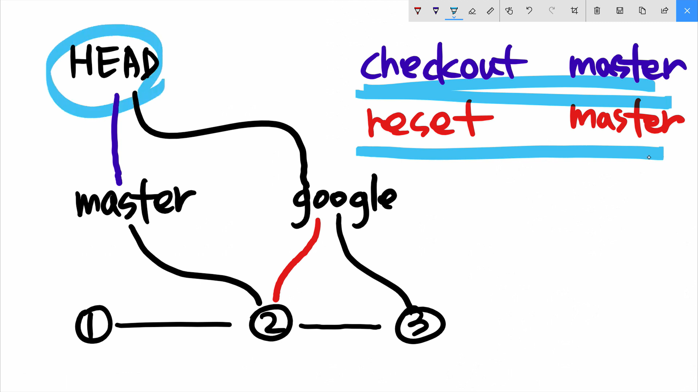

# 3. 이론 plus

- Head

- Branch

- Commit

이 셋을 조작하는게

`checkout` 과 `reset`

---

보통 head 가 현재 위치.

branch 가 버전이라고 생각하는데

HEAD는 branch (master, google)를 보통 직접 가리키지만,

commit를 가리킬 수도 있으며

이때는 `detached` 상태라고 부른다.

checkout은 repository (≒HEAD)를 바꾸는 것.

## checkout vs reset

checkout, reset 의 차이점

- checkout 은 언제나 head를 제어

- reset 은 head가 branch 를 가리키고 있는 동안에 branch 를 제어함

보면 checkout 은 헤드를 바꿔서 master가 가리키는 버전으로 바꿈

근데 reset은 구글을 master가 가리키는 버전으로 바꿔버림

이게 차이점임

그래서 보통 reset은 브랜츠 명이 아닌 버전 명을 씀
