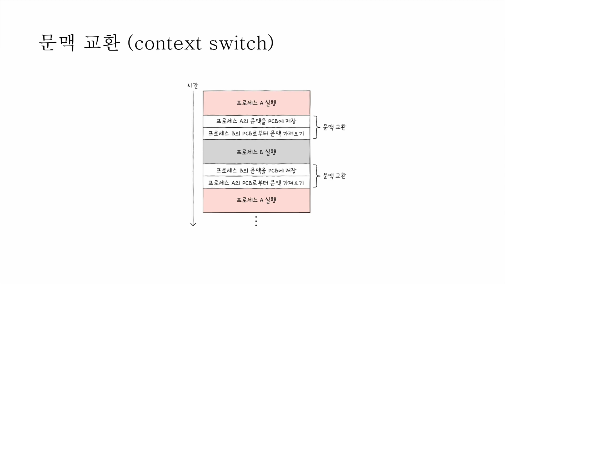
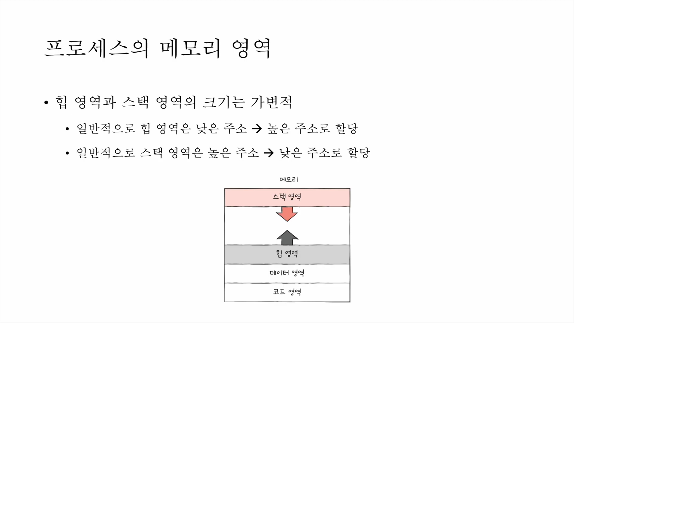

# 운영체제

## 운영체제란?

    시스템의 자원과 동작을 관리하는 소프트웨어

    프로세스, 저장장치, 네트워킹, 사용자, 하드웨어를 관리

### 프로세스

실행중인 프로그램

- 포그라운드 프로세스

  사용자가 볼 수 있는 공간에서 실행되는 프로세스

- 백그라운드 프로세스

  사용자가 볼 수 없는 공간에서 실행되는 프로세스

  - 사용자와 상호작용 가능한 백그라운드 프로세스

  - 상호작용하지 않고 정해진 일만 하는 백그 프로세스

    이를 `서비스`(service 윈도우), `데몬`(daemon 리눅스)

### 프로세스 제어 블록

모든 프로세스는 실행하기 위해 CPU 가 필요함

그리고 CPU 자원은 한정되어 있음

그렇기에 프로세스들은 한정된 시간만큼만 돌아가며 CPU를 이용함

여기서 `타이머 인터럽트` 가 시간을 알려줌

(클럭 신호 발생시키는 장치에 의해서 주기적으로 발생하는 하드웨어 인터럽트의 한 종류)

빠르게 번갈아 수행되기 때문에 프로세스 관리를 위해 사용하는 자료구조가 `프로세스 제어 블록임`(PCB)

- 프로세스 관련 정보를 저장하는 자료구조

- 상품에 달린 태그와 같은 정보를 저장

  태그에는 프로세스ID(고유id),

  레지스터 값(이전 레지스트 사용 중간값 복원),

  프로세스 상태, CPU 스케줄링 정보, 메모리 정보, 사용한 파일과 입출력 장치 정보

- 프로세스 생성시 커널 영역에서 생성, 종료시 폐기

### 문맥 교환 (context switch)

한 프로세스에서 다음 프로세스로 실행 순서가 넘어가면 문맥교환이 일어나게 됨

기존에 실행되던 프로세스의 중간 정보를 백업함

- 프로그램 카운터, 각종 레지스터 값, 메모리 정보, 열었던 파일, 사용자 입출력 장치 등

### 프로세스 메모리

- Code

  실행할 프로그램의 코드(텍스트 영역), 기계어로 이루어진 명령어 저장

  데이터가 아닌 CPU 가 실행할 명령어가 담기기에 쓰기가 금지 영역임

- Data

  전역 변수, 정적 변수

  잠깐 썼다가 없앨 데이터가 아닌 프로그램이 실행되는 동안 유지할 데이터 저장

- Heap

  사용자가 직접 할당 할수 있는 저장 공간

  사용자의 동적 할당 (런타임에 크기가 결정)

  메모리를 할당했으면 언젠가는 직접 다시 반환해야하는데 요즘은 프로그래밍 언어가 알아서 해주는데 그게 갈비지 컬렉션(Garbage Collection)임

  이를 안할시 메모리 누수가 발생함

- Stack

  지역 변수, 매개 변수 (컴파일에 크기 결정)

  데이터가 일시적으로 저장되는 공간

- 메모리 영역

힙과 스택 영역은 가변적임

일반적으로 힙은 낮은 주소 >> 높은 주소순으로 할당

스택은 높은 주소 >> 낮은 주소순으로 할당함

### 프로세스 상태

총 5개의 상태임

- 생성단계

  메모리에 생성되어 PCB를 할당 받은 상태

  준비 완료 되면 준비 상태로 ㄱㄱ

- 준비단계

  실행 가능이지만 차례가 아니므로 기달중

  차례가 되면 실행 상태로 ㄱㄱ

- 실행단계

  CPU 할당 받아 실행 중인 상태

  할당 시간 다 소용시(타이머 인터럽트 발생) 준비 상태로

  실행도중 입출력 장치를 사용하면 입출력 작업이 끝날때까지 대기 상태로

- 대기단계

  프로세스가 실행도중 입출력 장치 사용할 경우

  입출력은 CPU 보다 느리기 때문에 대기상태로 가는거

  입출력 작업이 끝나면(입출력 완료 인터럽트를 받으면) 준비 상태로

- 종료단계

  프로세스 종료

  PCB, 프로세스 메모리 정리

### 프로세스 계층 구조

윈도우는 프로세스 계층 구조가 아님

리눅스, 맥이 프로세스 계층 구조임

계층 구조란 프로세스 실행 도중 (시스템 호출을 통해) 프로세스를 생성하는 것

부모, 자식 프로세스로 구조화 됨

- 부모 프로세스와 자식 프로세스는 별개의 프로세스이기 때문에 PID 주소가 다름

- 일부 운영체제에서는 자식 프로세스에 부모 프로세스 PID(PPID) 를 명시하기도 함

프로세스 생성 기법은 `fork`(복제) 와 `exec`(교체) 임

부모 프로세스는 자신을 복제해서 자식 프로세스 생성하고

자식 프로세스는 자신의 메모리 공간을 새로운 프로개램으로 덮어씌움(코드/ 데이터 영역은 실행할 프로그램 내용으로 바뀌고, 나머지 영역은 초기화)

## 레퍼런스

- [[컴퓨터 기초] 메모리구조](https://jinshine.github.io/2018/05/17/%EC%BB%B4%ED%93%A8%ED%84%B0%20%EA%B8%B0%EC%B4%88/%EB%A9%94%EB%AA%A8%EB%A6%AC%EA%B5%AC%EC%A1%B0/)

## 추가 공부

- [[개발자 장고]기술면접 질문 리스트 - 운영체제](https://docs.google.com/document/d/17MDlmTwXcKo7xC_IExTxdDpLtdyPWssPmOt1cgDiaAc/edit)
