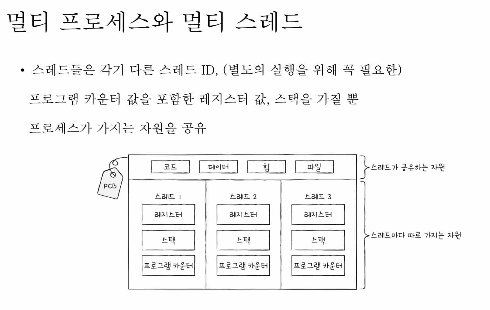
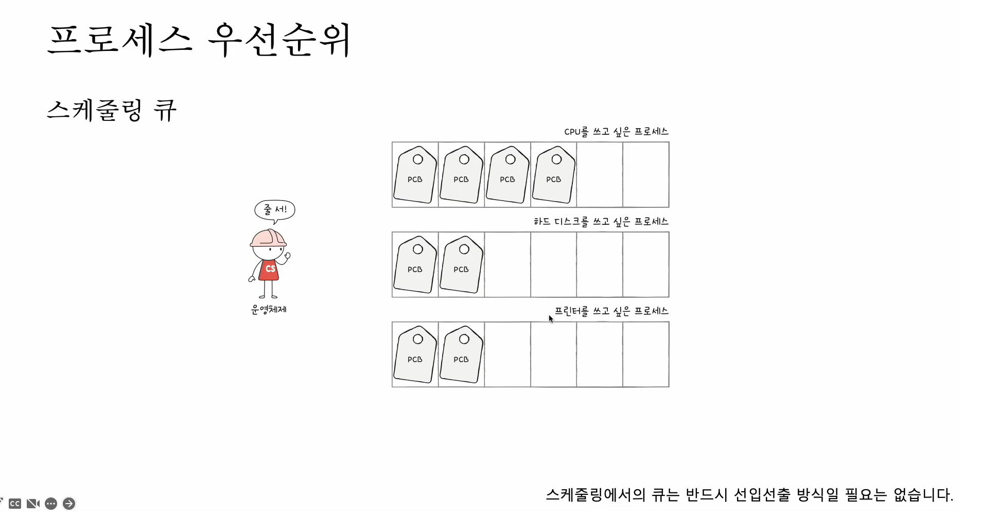
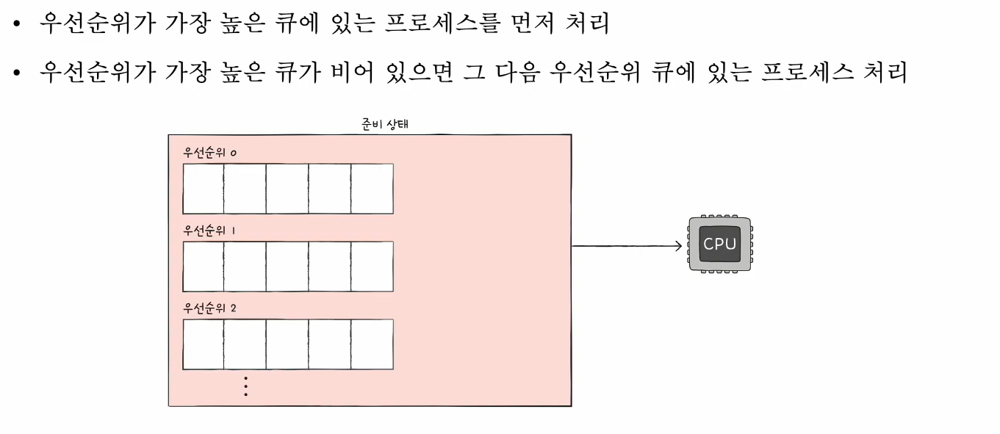

### 쓰레드

- 스레드 : 프로세스를 구성하는 실행 흐름의 단위

하나의 프로세스는 하나 이상의 스레드를 가질 수 있음

각각의 프로세스는 독립

- 구성요소

  스레드 ID, 프로그램 카운터, 레지스터 값, 스택 등

  실행에 필요한 최소한의 정보

### 멀티 프로세스, 멀티 스레드

멀티 프로세스와 멀티 스레드은 차이점이 뭘까

간단함 스레드는 메모리를 공유하고 프로세스는 메모리를 각자 가짐

프로세스가 fork 하면 코드, 데이터, 힙, 영역등 모든 자원 복제되어 저장됨

동일한 프로세스가 메모리에 생기는거임

> 참고로 fork 직후 같은 프로세스를 통으로 메모리에 중복 저장 하지 않고  
> 동시에 프로세스끼리 자원을 공유하지 않는 방법이 있음 (쓰기 식 복사 기법)

스레드들은 실행에 필요한 정보만 다를 뿐 프로세스가 가지는 자원을 공유

- 프로세스끼리 자원을 공유하지 않는다 >> 남남처럼 독립적으로 실행

  - 프로세스간에도 자원 교환 가능 (프로세스간 통신 IPC)

  - 파일을 통한 프로세스 간 통신, 공유 메모리를 통한 프로세스 간 통신

- 스레드는 프로세스의 자원을 공유 >> 협력과 통신에 유리

### CPU 스케쥴러

    준비큐에 있는 프로세스에 대해 cpu 할당하는 방법

운영체제가 프로세스들에게 합리적으로 CPU 자원을 배분하는 것

여러 프로세스들을 어떤 기준으로 `우선순위`(priority)를 두고 처리하느냐가 핵심 (입출력 작업이 많은 프로세스, CPU 작업이 많은 프로세스)

- 스케줄링 큐

  실행할 프로세스들을 우선순위에 맞춰서 줄을 세운것

  

  이 스케줄링 큐도 하나로만 하는게 아니라 여러개로 나눠서 운영함

  - 준비큐

    CPU를 이용하기 위해 기다리는 큐

  - 대기큐

    입출력 장치를 이용하기 위해 기다리는 큐 (프린터 대기큐, 하드디스크 대기큐 등)

### 선점, 비선점 스케줄링

- 선점

  하고 있던거(CPU 점유) 뺏어서 본인꺼 하는거

  장점: 프로세스 독점을 막고 프로세스들에 골고루 자원 배분

  단점: 그만큼 문맥교환이 일어나 CPU 오버헤드가 일어날수 있음

  - RR(Round Robin) : 돌아가면서 조금씩 다하는거

    선입 선처리 스케줄링 + 타임 슬라이스

    타임 슬라이스: 각 프로세스 CPU 이용 시간

    정해진 시간만큼 동안 돌아가며 CPU 이용하는 선점형 스케줄링 (정해진 시간이 다 지나도 완료 안됐음 큐 맨 뒤로 삽입)

  - SRT(Shortest Remaining Time) : 잔여시간 가장 짧은거

    최단 작업 우선 스케줄링 + 라운드 로빈 스케줄링

    정해진 시간만큼 CPU이용 하되 남은 작업 시간이 가장 적은 순으로

  - Ps(Priority Scheduling) : 우선 순위가 높은거

    프로세스에 우선순위를 부여하고, 순위 높은 순으로 실행

    순위 같은 애들은 선입선처리 진행

    단점: 기아현상 발생(낮은 우선순위 얘는 평생 안되는 경우가 생김)

    방지법

    - 에이징(aging) : 대기중인 프로세스의 우선순위를 점차적으로 증가시킴

  - MLQ(MultiLevel Queue Scheduling) : 다단계 큐

    우선 순위 스케쥴링의 발전된 형태

    우선 순위별로 준비 큐를 여러개 사용하는 방식

    

    근데 이거 역시 기아현상 발생 쌉가능

  - MFQ(MultiLevel Feedback Queue Scheduling) : 다단계 피드백 큐

    다단계 큐 발전된 형태 큐 간의 이동이 가능함

    - 타임 슬라이스 시간만큼 이용을 하고 나서 안끝나면 우선순위가 다음으로 높은 순으로 삽입됨 (0 > 1)

    - 에이징 적용해서 낮은 우선 순위 큐에 있는 프로세스를 점차적으로 증가 시킴

- 비선점

  장점: 선점형보다 오버헤드 적음

  단점: 모든 프로세스가 골고루 자원 이용하기 어렵

  - FCFS(First Come First Served) : 선입선처리

    단순히 준비 큐에 삽입된 순서대로 처리하는 비선점 스케쥴링

    단점: 프로세스들이 기다리는 시간이 매우 길어질수 있음(호위 효과)

  - SJF(Shortest Job First) : 최단 작업 우선

    CPU 사용 시간이 짧은 순으로 진행

    호위효과 방지

## 가상메모리

    모든 프로세스 메모리를 가져오기에는 메모리 크기가 한계가 있어

    프로세스에서 사용할 부분만 메모리에 나머지는 디스크에 보관하는

    기법

## 데드락

    프로세스가 자원을 얻지 못해 다음 작업 못하는 상태

### 데드락 발생 조건

4가지가 있는데 4개 다 동시에 성립할때 발생

- 상호배제

- 점유대기

- 비선점

- 순환대기
