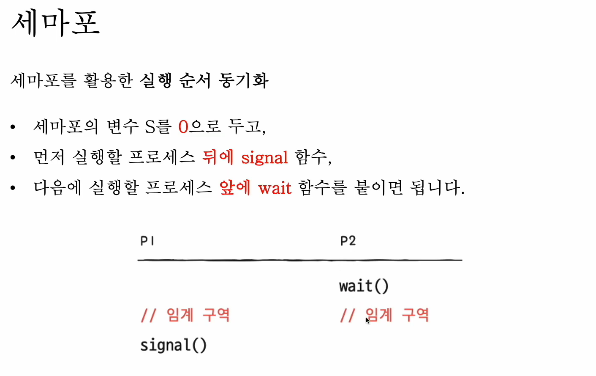
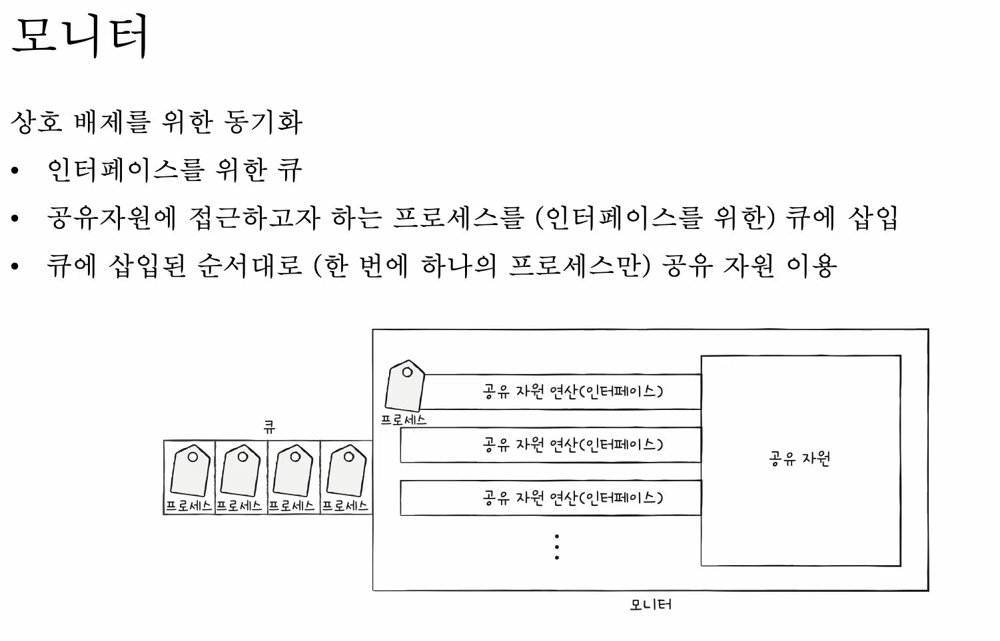

### 동기화

    프로세스(스레드)들의 수행시기를 맞추는 것

- 실행 순서 제어

  파일을 저장하는 함수와 저장된 값을 읽는 함수 두개가 있다고 했을때

  저장된 값을 읽는 함수가 먼저 실행되면 파일이 저정되어 있지 않아 문제가 생긴다

  이처럼 특정 조건을 만족되어야 실행 가능

- 상호배제

  공유하는 자원에 동시에 접근하게 되면 제대로 연산이 안될꺼임

  가령 종합 금액 10 이란 전역변수에 +2 하는 함수와 +5 하는 함수 각각 동시에 실행된다면

  17이 되는게 아니라 15가 됨

  한번에 하나의 프로세스만 접근하게 해야함

#### 공유자원, 임계구역

- 공유자원

  공동으로 이용하는 변수, 파일, 장치 등의 자원

- 임계구역

  공유자원에 접근하는 코드중에 동시에 실행하면 문제가 발생하는 코드 영역

  임계구역에 동시에 접근하면 자원 일관성이 깨질 수 있음 이를 `레이스 컨디션`(race condition) 이라 함

운영체제가 임계구역 문제를 해결하기 위해 3가지 원칙을 세움

- 상호배제

  한 프로세스가 임계구역에 들어왔음 다른 프로세스는 못들어감

- 진행

  임계구역에 어떤 프로세스도 없다면 진입하고자 하는 프로세스는 들어갈수 있어야함

- 유한 대기

  임계구역에 진입하고 싶다면 언젠간은 임계구역에 들어갈 수 있어야함 (무한정 대기해서는 안됨)

#### 동기화 기법

동기화 기법으로 뮤텍스 락, 세마포, 모니터 등 이 있음

- 뮤텍스 락 (바쁜대기 busy waiting)

  상호 배제를 위한 동기화 도구(자물쇠 역활)

  ```java
  static boolean lock = false // 잠금 여부 확인 전역변수

  // 임계구역이 잠겨 있는지 계속 확인해서 풀려있으면 잠금
  acquire(){
      while(lock == true){
          ;
      }
      lock = true;
  }


  // 전역변수 품
  release(){
      lock = false;
  }
  ```

  이럴때

  ```
  acquire();
  // 임계구역 실행
  release();
  ```

  이런식으로 진행됨

- 세마포(카운팅)

  좀 더 일반화된 방식의 동기화 도구

  공유 자원이 여러 개 있는 경우에도 적용 가능

  이진 세마포, 카운팅 세마포가 있음

  - busy waiting

    뮤텍스 락과 비슷함 그래서 CPU 사이클 낭비가 좀 있음

    ```java
    // 임계구역에 들어갈 수 잇는 프로세스 갯수
    static int S = 2;

    // 임계구역에 들어가도 되는지 확인 함수
    wait(){
        while (S <= 0){
            ;
        }
        S --;

    }

    // 임계 구역


        // 임계구역 프로세스 가능수 추가
    signal(){
        S ++;
    }
    ```

  - queue

    사용 할 수 있는 자원이 없을 경우 대기 상태로 만듦

    사용 할 수 잇는 자원이 있을 경우 준비 상태로 만듦

    ```java
    static int S = 2;

    // 해당 프로세스를 대기큐에 삽입
    // 대기 상태로 접어듬
    wait(){
        S--;
        if (S < 0){
            // add this process to Queue
            sleep();
        }
    }
    // 대기큐에 있는 프로세스 제거
    // 프로세스를 대기 상태에서 준비 상태로 만듬
    signal(){
        S ++
        if (S <= 0){
            // remove a process p from Queue
            wakeup(p)
        }
    }
    ```

    만약 p1 이 p2 보다 먼저 실행해야한다면

    

    이렇게 되야함

    CPU 낭비는 없앴지만 이러면 이용하기 불편함

    누락시켜버리던가 wait, signal 함수 순서를 틀리던가 해서

  - 모니터

    

    솔직히 요건 잘 이해가 안감

    한번 따로 찾아봐야 할듯???
